# MATLAB 语音合成实验

> 无 76	RainEggplant	2017\*\*\*\*\*\*


## 1. 语音预测模型

### (1) 滤波器

题目中的差分方程如下：
$$
e(n) = s(n) - a_1 s(n-1) - a_2 s(n-2)
$$
对其做 z 变换，得
$$
E(z) = S(z) - a_1 z^{-1} S(z) - a_2 z^{-2} S(z)
$$
因此传递函数为
$$
H(z) = \frac {S(z)}{E(z)} = \frac {1}{1 - a_1 z^{-1} - a_2 z^{-2}}
$$


每一对共轭极点都对应一个衰减的正弦信号的特征响应。例如一对共轭极点 $$|p_i|e^{\pm j \Omega}$$ 在时域冲激响应中的贡献是 $$A|p_i|^n \mathrm{cos} (\Omega n+\varphi)$$ 。 其中极点幅度决定衰减速度， 幅角决定振荡频率。 

因此，要求共振峰频率，需要先求出极点。

当 $$a_1 = 1.3789$$， $$a_2 = -0.9506$$ 时，调用 `roots([1 -1.3789 0.9506])`,  得到极点为：
$$
p_1 = 0.6895+0.6894i, \ p_2=0.6895-0.6894i
$$
因此，共振峰频率 $$\Omega=\mathrm{abs}(\mathrm{angle}(p_i))=0.7854=0.25\pi$$ rad/sample。


编写函数 `plot_filter` 如下（文件位于 `src/plot_filter.m`）

```matlab
function plot_filter(b, a)
    % Plot zeros and polars
    figure;
    zplane(b, a);

    % Plot frequency response
    figure;
    freqz(b, a);
    % Find maximum and mark it
    h_line = findobj(gca, 'Type', 'line');
    h = get(h_line, 'Ydata');
    [h_max, idx] = max(h(1:length(h)-1));
    w = get(h_line,'Xdata');
    w_max = w(idx);
    text(w_max-0.05, h_max + 4, ...
        ['(', num2str(w_max), ',', num2str(h_max), ')']);

    % Use `impz` to draw impulse response
    figure;
    subplot(2, 1, 1);
    impz(b, a, 100);
    title('Impulse Response (using `impz`)');

    % Use `filter` to draw impulse response
    x = zeros(1,100);
    x(1) = 1;
    y = filter(b, a, x);
    subplot(2, 1, 2);
    stem([1:100], y);
    title('Impulse Response (using `filter`)');
    xlabel('n (samples)');
    ylabel('Amplitude');
end
```


调用 `plot_filter(1, [1, -1.3789, 0.9506])`，得到以下结果：

**零、极点分布图**

可以看到，原点处有一二阶零点。单位圆内靠近单位圆处上有一对一阶共轭极点。

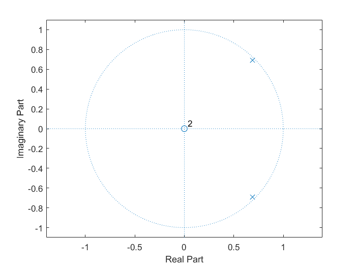


**频率响应**

从这张图上，我们得到上述合成模型的共振峰频率为 $$0.25 \times \pi$$ rad/sample，与理论计算是一致的。

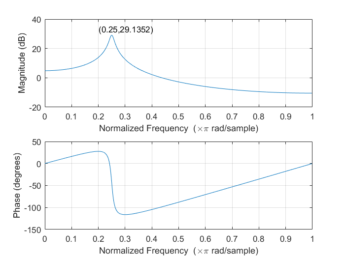


采样率 $$sr=8000$$ Hz 时, 共振峰的模拟频率为 $$f=\dfrac{\Omega \cdot sr}{2 \pi}=1000$$ kHz。


**单位样值响应**

可以看到两种方式求得的单位样值响应是一致的。

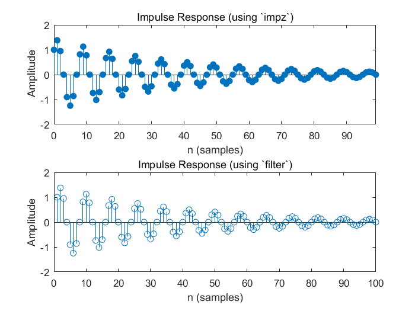


### (2) 阅读 `speechproc.m` 并理解基本流程

基本流程如下：

- 定义帧长、窗长等常数
- 载入语音，定义合成信号、滤波器状态等变量
- 依次处理每帧语音
  - 计算预测系数
  - 若进行到第 27 帧，则观察预测系统的零极点图
  - 使用 `filter` 计算本帧语音 `s_f` 的激励 `exc`
  - 使用 `filter` 与 `exc` 重建语音 `s_rec`
  - 计算基音周期 `PT` 和合成激励的能量 `G`
  - 利用 `PT` 和 `G` 生成合成激励，并用 `filter` 生成合成语音 `s_syn`
  - 将合成激励的长度增加一倍，再利用 `filter` 生成慢一倍的语音 `s_syn_v`
  - 将基音周期减小一般，共振峰频率增加 150 Hz, 合成音调变高的语音 `s_syn_t`
- 试听与画出上述语音
- 保存上述语音与激励


### (3) 观察 27 帧时预测系统的零、极点分布图

类似 (1), 调用 `zplane` 即可。程序代码如下：

```matlab
if n == 27
	% (3) 在此位置写程序，观察预测系统的零极点图
    figure;
    zplane(A, 1);
    title('27 帧时预测系统的零、极点分布图');
end
```

结果如图：

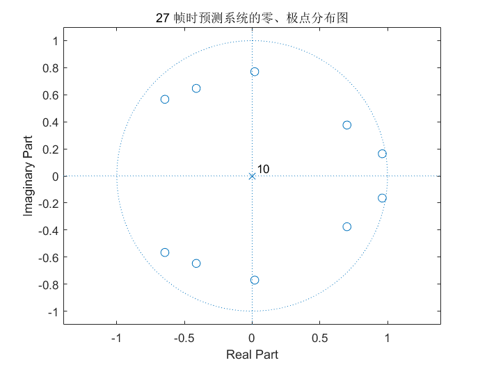


可以看到，因为预测系统相当于是声道模型的逆系统，所以其零、极点是互相对换的。27 帧时的预测系统有 1 个 10 阶极点和 5 对单位圆内的共轭零点。


### (4) 用 `filter` 计算激励信号

语音的非平稳性导致预测系数是时变的，在这种情况下，滤波过程也要分段进行，即每次用不同的滤波器系数。但是需要注意的是，相邻两次滤波必须要保持滤波器的状态不发生变化。因此，我们需要用到 `filter` 函数的 `zi` 和 `zf` 参数。

程序代码如下：

```matlab
% (4) 在此位置写程序，用 filter 函数 s_f 计算激励，注意保持滤波器状态
[exc((n-1)*FL+1:n*FL), zi_pre] = filter(A, 1, s_f, zi_pre);
```


### (5) 用 `filter` 和 $$e(n)$$ 重建语音

在 (4) 中，我们利用预测系统计算得到了激励信号 `exc` （即 $$e(n)$$ ）和预测模型参数。只要让 `exc` 再经过预测系统的逆系统，即可得到重建语音。故我们调换 `filter` 函数的 `b`, `a` 参数，同时注意保持滤波器状态即可。

程序代码如下：

```matlab
 % (5) 在此位置写程序，用 filter 函数和 exc 重建语音，注意保持滤波器状态
[s_rec((n-1)*FL+1:n*FL), zi_rec] = ... 
	filter(1, A, exc((n-1)*FL+1:n*FL), zi_rec);
```


### (6) 试听并对比 $$e(n)$$, $$s(n)$$ 及 $$\hat {s} (n)$$ 信号

添加代码，试听以上信号。

因为该音频文件的位深度为 16 位，故幅度应当除以 $$\rm{INT16\_MAX\_ABS}=2^{15}=32768$$。因此在函数开头定义常数处增加：

```matlab
INT16_MAX_ABS = 32768;
```

然后添加如下代码：

```matlab
% (6) 在此位置写程序，听一听 s, exc 和 s_rec 有何区别，解释这种区别
sound([s; s_rec; exc] / INT16_MAX_ABS, 8000);
```

可以听到，$$s(n)$$ 及 $$\hat {s} (n)$$ 都是清晰、自然的 “电灯比油灯进步多了”，并且听不出区别。而 $$e(n)$$ 信号虽然能够听出是同一句话，但其整体音量减小，音色有非常强烈的颗粒感，感觉频率分量非常丰富。


添加如下代码，作出三者波形。注意该绘图和后面的局部波形绘图都使用了 `linkaxes` 函数，使得三者波形能够同步缩放与移动。

```matlab
% 画三者波形
time = [0:L-1] / sr;
figure;
ax1 = subplot(3, 1, 1);
plot(time, s);
ylabel('s(n)');

ax2 = subplot(3, 1, 2);
plot(time, s_rec);
ylabel('$\hat{s}(n)$', 'Interpreter', 'latex');

ax3 = subplot(3, 1, 3);
plot(time, exc);
ylabel('e(n)');

linkaxes([ax1, ax2, ax3],'xy')
ylim([-INT16_MAX_ABS, INT16_MAX_ABS]);
```

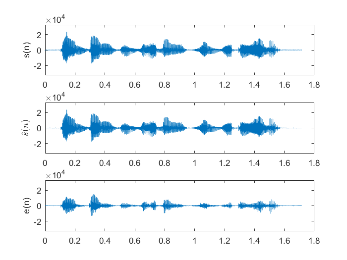


添加如下代码，选择 0.6~0.78 s 的音频，作出三者的局部波形：

```matlab
% 画三者局部波形
part_time = 0.6:1/sr:0.78;
sample_range = 0.6*sr:0.78*sr;
figure;
ax1 = subplot(3, 1, 1);
plot(part_time, s(sample_range));
ylabel('s(n)');

ax2 = subplot(3, 1, 2);
plot(part_time, s_rec(sample_range));
ylabel('$\hat{s}(n)$', 'Interpreter', 'latex');

ax3 = subplot(3, 1, 3);
plot(part_time, exc(sample_range));
ylabel('e(n)');

linkaxes([ax1, ax2, ax3],'xy')
xlim([0.6, 0.78]);
ylim([-1.2e4, 1.2e4]);
```

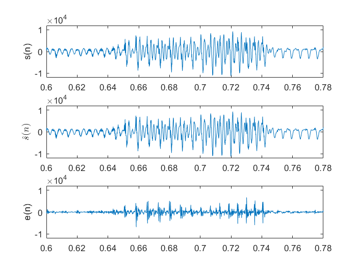


仔细分析这两张波形图，可以看到，$$s(n)$$ 与 $$\hat {s} (n)$$ 的波形几乎完全重合，因此听起来自然没有区别。这是理所应当的，因为一个信号经过一个系统，再经过该系统的逆系统，得到的输出和输入应该是一致的。

再看 $$e(n)$$ 的波形，首先可以看到其幅度小于前两者，自然音量就比较小。然后仔细看局部波形图，我们可以发现 $$e(n)$$ 的变化较 $$s(n)$$ 或 $$\hat{s} (n)$$ 更加频繁，说明其高频分量更多。这也是自然的，因为在语音生成模型中，声门脉冲串本来就含有丰富的谐波。

可以通过画出频谱图来验证我们的推测，添加代码如下：

```matlab
% 画出 s 和 exc 的频谱图
S = fft(s);
EXC = fft(exc);
freq = sr*(0:(L/2))/L;
figure;
subplot(2, 1, 1);
plot(freq, abs(S(1:L/2+1)));
ylabel('s(n) 频谱');

subplot(2, 1, 2);
plot(freq, abs(EXC(1:L/2+1)));
ylabel('e(n) 频谱');
```

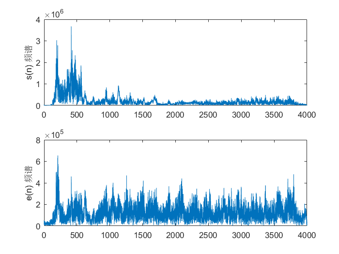

可见我们的推测是正确的。


## 2. 语音合成模型

### (1) 生成基音周期固定的单位样值串

单位样值串的定义为：
$$
x(n)=\sum_{i=0}^{NS-1} \delta(n-iN)
$$
当采样率 $$sr=8$$ kHz 时，对于频率 $$freq=200$$ Hz，持续时间 $$duration=1$$ s 的单位样值串，$$N=\dfrac{sr}{freq}=40$$, $$NS=freq \times duration=200$$。

下面的代码位于文件 `src/generate_signal.m`, 定义了函数 `generate_signal(sr, freq, duration)`。注意我们针对 $$sr/freq$$ 不为整数的可能特意做了处理，以尽量减小误差。

```matlab
function s = generate_signal(sr, freq, duration)
    sample_per_cycle = sr/freq;
    NS = round(freq*duration);
    s = zeros(1, round(sr*duration))';
    
    for k = 0:NS-1
        s(round(sample_per_cycle*k)+1) = 1;
    end
end
```


试听生成的 200 Hz 和 300 Hz 信号，即调用：

```matlab
sound(generate_signal(8000, 200, 1), 8000);
sound(generate_signal(8000, 300, 1), 8000);
```

直观的感受是 300 Hz 的信号听起来更高，而且恰好比 200 Hz 信号高一个纯五度。


### (2) 生成基音周期变化的信号

思路是生成一个脉冲，然后根据该信号所在的段序号确定下一个脉冲的位置，如此反复直到生成完毕。下面的代码位于文件 `src/generate_varied_signal.m`：

```matlab
function s = generate_varied_signal(sr, duration)
    s_len = round(sr*duration);
    s = zeros(1, s_len)';
    pulse_pos = 1;
    while pulse_pos <= s_len
        s(pulse_pos) = 1;
        m = ceil(pulse_pos/(0.01*sr));
        pulse_pos = pulse_pos+80+5*mod(m, 50);       
    end
end
```


生成 1 s 的信号，并作出波形。即调用：

```matlab
s = generate_varied_signal(8000, 1);
figure;
plot([0:7999]/8000, s);
```

波形如下：

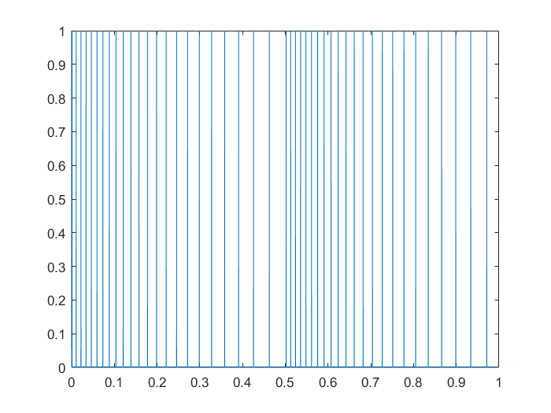

可以看到，这的确是一个基音周期不断变化的单位样值串。

调用 `sound(s, 8000)` 听一下，说实在的，有点难听，听起来就像是气流高速通过人体某个部位时产生的声音一样。


### (3) 将 (2) 中信号输入 1.(1) 的滤波器

下面的代码位于文件 `src/show_filtered_signal.m`。需要注意的是经过滤波之后，有的地方的幅度可能会超过 1，这里通过 `s/max(abs(s))` 进行归一化处理。

```matlab
function show_filtered_signal()
    L = 8000; % 信号长度
    e = generate_varied_signal(8000, 1);
    s = filter(1, [1, -1.3789, 0.9506], e);
    sound(s/max(abs(s)), 8000);
    
    % 画出 s(n) 波形
    figure;
    plot(s);
    
    % 画出 e(n), s(n) 频谱
    E = fft(e);
    S = fft(s);
    freq = 0:4000;
    
    figure;
    subplot(2, 1, 1);
    plot(freq, abs(S(1:L/2+1)));
    ylabel('s(n) 频谱');
    
    subplot(2, 1, 2);
    plot(freq, abs(E(1:L/2+1)));
    ylabel('e(n) 频谱');
end
```


作出 $$e(n)$$ 波形如下：

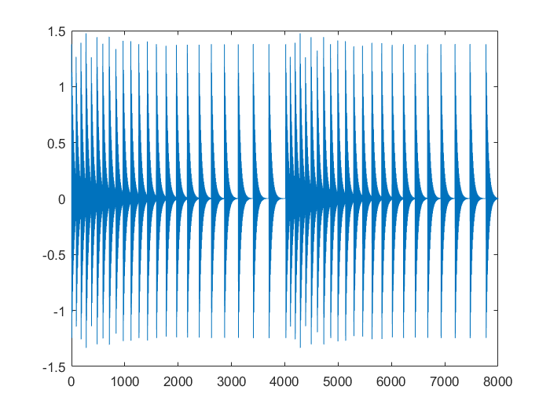


作出 $$e(n)$$ 和 $$s(n)$$ 的频谱如下：

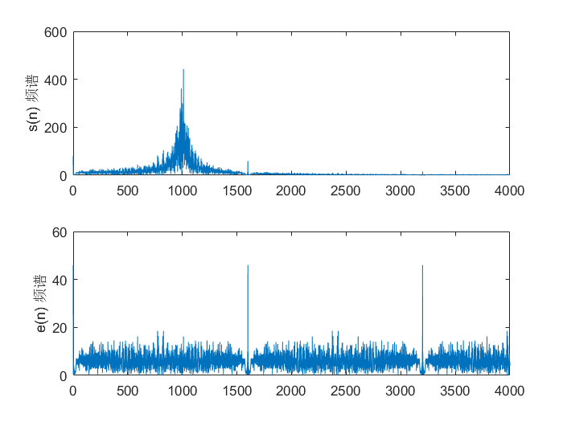

从波形来看， $$s(n)$$ 变得更平缓了；从频谱来看，正好对应高频分量减少。同时可以看到， $$s(n)$$ 信号的频谱在 1000 Hz 处有最大值，这符合该滤波器的幅频特性。


最后从听觉上来讲， $$s(n)$$ 听起来要闷一些，但也不刺耳了，像是经过一个管道后发出的声音，这应该正是声管模型的体现吧。


### (4) 合成语音

首先在函数开头定义 `zi_syn` 用于保存合成滤波器的状态：

```matlab
zi_syn = zeros(P,1);    % 合成滤波器的状态
```

然后设置激励信号的起始位置：

```matlab
pulse_pos = 2*FL+1;
```

在循环中利用每一帧计算得到的基音周期合成激励信号，再使用合成滤波器合成语音信号 $$\tilde{s}(n)$$。

```matlab
% (10) 在此位置写程序，生成合成激励，并用激励和 filter 函数产生合成语音
while pulse_pos <= n*FL
    exc_syn(pulse_pos) = G;
    pulse_pos = pulse_pos+PT;
end
[s_syn((n-1)*FL+1:n*FL), zi_syn] = ...
	filter(1, A, exc_syn((n-1)*FL+1:n*FL), zi_syn);
```

最后画出原始信号 $$s(n)$$ 和合成信号 $$\tilde{s}(n)$$ 的波形，并试听 $$\tilde{s}(n)$$ :

```matlab
% 试听 s_syn 并 画出 s, s_syn 波形
sound(s_syn/INT16_MAX_ABS, sr);
figure;
ax1 = subplot(2, 1, 1);
plot(time, s);
ylabel('s(n)');

ax2 = subplot(2, 1, 2);
plot(time, s_syn);
ylabel('$\tilde{s}(n)$', 'Interpreter', 'latex');

linkaxes([ax1, ax2],'xy')
ylim([-INT16_MAX_ABS, INT16_MAX_ABS]);
pause(2);
```


波形图如下：

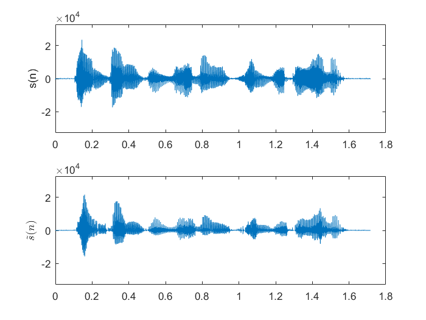

可以看到二者波形的大体形状比较接近，但 $$s(n)$$ 的上下更加对称。

从听感上， 能很清楚的听到 $$\tilde{s}(n)$$ 的内容。但是和 $$s(n)$$ 相比，还是有以下的不同：

-  $$\tilde{s}(n)$$ 听起来仍然有轻微的颗粒感
-  $$\tilde{s}(n)$$ 的清音听起来有些奇怪，例如 ”电灯比油灯进步多了“ 中 ”进“ 的声母 ”j“，有一种大舌头的感觉。不过这也是受限于我们的模型比较简单的结果。


## 3. 变速不变调

### (1) 合成慢一倍的语音

 和上一问思路一致，首先在函数开头定义 `zi_syn_v` 用于保存合成滤波器的状态：

```matlab
zi_syn_v = zeros(P,1);    % 合成滤波器的状态（变速不变调）
```

然后设置帧长和激励信号的起始位置：

```matlab
FL_v = FL*2;
pulse_pos_v = 2*FL_v+1;
```

在循环中利用每一帧计算得到的基音周期合成激励信号，再使用合成滤波器合成语音信号。

```matlab
% (11) 不改变基音周期和预测系数，将合成激励的长度增加一倍，再作为 filter
% 的输入得到新的合成语音，听一听是不是速度变慢了，但音调没有变。
while pulse_pos_v <= n*FL_v
	exc_syn_v(pulse_pos_v) = G;
    pulse_pos_v = pulse_pos_v+PT;
end
[s_syn_v((n-1)*FL_v+1:n*FL_v), zi_syn_v] = ...
	filter(1, A, exc_syn_v((n-1)*FL_v+1:n*FL_v), zi_syn_v);
```

试听，发现音调的确基本没有变化，但是速度慢了一倍。但是上一节提到的问题因为速度变慢，更容易察觉了。


## 4. 变调不变速

### (1) 将 1.(1) 中滤波器的共振峰频率提高 150 Hz

如果保持极点的幅度不变，使极点的幅角绝对值增大，即让上半平面的极点逆时针旋转，下半平面的顺时针旋转（但注意两者都要旋转同样角度而且不要转过负实轴 ），则可以增加共振峰的频率。

在 $$sr=8000$$ Hz 的采样率下，150 Hz 模拟频率对应的数字频率应为 $$\Delta \Omega =\dfrac{2 \pi f}{sr}=0.0375 \pi$$ rad/sample。因此若要使得 1.(1) 中滤波器的共振峰频率提高 150 Hz, 则应当使其极点俯角的绝对值增大 $$0.0375 \pi$$。

因此，我们的思路如下：先求得原极点，再根据极点的虚部正负确定旋转方向，然后旋转指定角度。编写函数 `rotate_poles` 如下（文件位于 `src/rotate_poles.m`）：

```matlab
function a_rotated = rotate_poles(a, rot_angle)
    poles = roots(a);
    new_poles = arrayfun(...
        @(p) p*exp(rot_angle * sign(imag(p)) * 1j), ...
        poles);
    a_rotated = poly(new_poles)*a(1); % times coefficient
end
```


由题意，执行

```matlab
a = rotate_poles([1, -1.3789, 0.9506], 0.0375 * pi);
```

得到 `a = [1.0000   -1.2073    0.9506]`, 从而 $$a_1=1.2073$$, $$a_2=-0.9506$$。

不妨调用 1.(1) 中定义的 `plot_filter` 函数看看结果，即调用 `plot_filter(1, a)`，得到：

**零、极点分布图**

因为变化的角度比较小，所以从这张图上看不够明显。

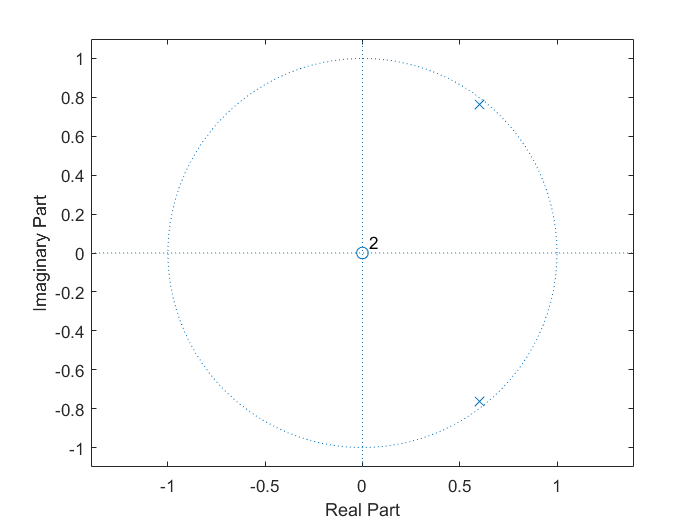

**频率响应**

从这张图上，我们能够知道调整后的滤波器的共振峰频率为 $$0.2876 \times \pi$$ rad/sample，对应的模拟频率为 $$1150.4 \approx 1150$$ Hz。说明我们的调整是正确的。

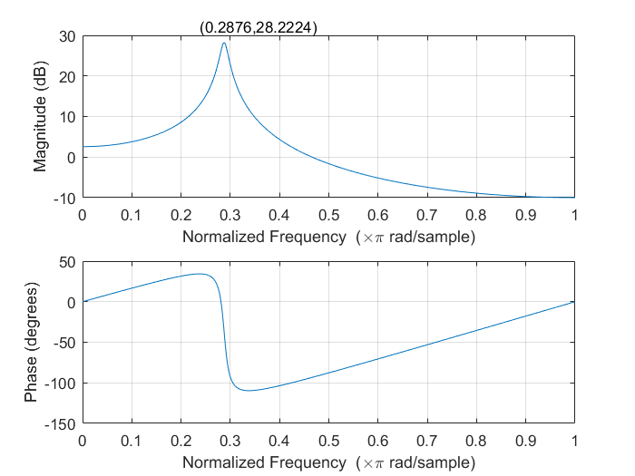


### (2) 合成音调变高的语音

仍和之前思路一直，首先在函数开头定义 `zi_syn_t` 用于保存合成滤波器的状态：

```matlab
zi_syn_t = zeros(P,1);    % 合成滤波器的状态
```

然后设置激励信号的起始位置：

```matlab
pulse_pos_t = 2*FL+1;
```

在循环中合成激励信号时，将计算得到的基音周期减半，同时提高合成滤波器共振峰的频率，然后再使用其合成语音信号。

```matlab
% (13) 将基音周期减小一半，将共振峰频率增加 150Hz，重新合成语音，听听是啥感受～
while pulse_pos_t <= n*FL
	exc_syn_t(pulse_pos_t) = G;
	pulse_pos_t = pulse_pos_t+round(PT/2);
end
A_150 = rotate_poles(A, 2*pi*150/sr);
[s_syn_t((n-1)*FL+1:n*FL), zi_syn_t] = ...
	filter(1, A_150, exc_syn_t((n-1)*FL+1:n*FL), zi_syn_t);
```

最后作出波形，进行对比：

```matlab
% 试听 s_syn_t 并画出 s, s_syn_t 波形
figure;
ax1 = subplot(2, 1, 1);
plot(time, s);
ylabel('s(n)');

ax2 = subplot(2, 1, 2);
plot(time, s_syn_t);
ylabel('s_syn_t(n)');

linkaxes([ax1, ax2],'xy')
ylim([-INT16_MAX_ABS, INT16_MAX_ABS]);
sound(s_syn_t/INT16_MAX_ABS, sr);
```

 

结果如下：

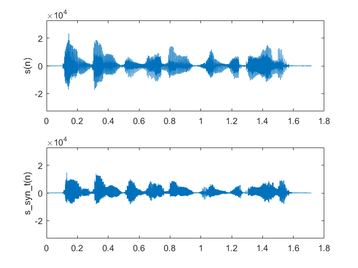

可以看到，由于频率提高，波形变得更密。从听感上，声音变成了女性的声音，但时长没有发生变化。


## 探究思考

### 变速 + 变调

课本中提到，变速与变调可以完美地结合在一起。我针对原程序做了些许修改，得到了能同时变速、变调的合成语音算法。

该算法的调用方式为 `s_syn =  speechproc_pro(filename, sr, speed, pitch, peak)`，其中 `filename` 是 pcm 音频文件的完整路径，`sr` 是采样率，`speed` 、`pitch` 是合成语音与原始语音的速度、基音频率比，`peak` 是共振峰频率的增减量。定义函数的代码如下（位于 `src/speechproc_pro.m`）：

```matlab
function s_syn = speechproc_pro(filename, sr, speed, pitch, peak)
    % 定义常数
    INT16_MAX_ABS = 32768;
    FL = 80;                % 帧长
    FL_out = round(FL/speed); % 输出语音帧长
    WL = 240;               % 窗长
    P = 10;                 % 预测系数个数
    s = readspeech(filename, 100000);     % 载入语音 s
    L = length(s);          % 读入语音长度
    FN = floor(L/FL)-2;     % 计算帧数
    L_out = FL_out*(FN+2); % 输出语音长度
    % 预测滤波器
    exc = zeros(L, 1);       % 激励信号（预测误差）
    zi_pre = zeros(P, 1);    % 预测滤波器的状态
    % 合成滤波器
    exc_syn = zeros(L_out,1);   % 合成的激励信号（脉冲串）
    s_syn = zeros(L_out,1);     % 合成语音
    zi_syn = zeros(P,1);    % 合成滤波器的状态
    
    hw = hamming(WL);       % 汉明窗
    
    pulse_pos = 2*FL_out+1;     % 激励信号的起始位置
    
    % 依次处理每帧语音
    for n = 3:FN
        % 计算预测系数（不需要掌握）
        s_w = s(n*FL-WL+1:n*FL).*hw;    % 汉明窗加权后的语音
        [A, E] = lpc(s_w, P);            % 用线性预测法计算 P 个预测系数
                                        % A是预测系数，E 会被用来计算合成激励的能量
        
        s_f = s((n-1)*FL+1:n*FL);       % 本帧语音，下面就要对它做处理

        % 用 filter 函数和 s_f 计算激励，注意保持滤波器状态
        [exc((n-1)*FL+1:n*FL), zi_pre] = filter(A, 1, s_f, zi_pre);

        % 注意下面只有在得到 exc 后才会计算正确
        s_Pitch = exc(n*FL-222:n*FL);
        PT = findpitch(s_Pitch);    % 计算基音周期 PT（不要求掌握）
        G = sqrt(E*PT);           % 计算合成激励的能量 G（不要求掌握）
      

        % 不改变预测系数，改变合成激励的长度、基音周期，改变共振峰频率，
        % 合成新语音。
        while pulse_pos <= n*FL_out
           exc_syn(pulse_pos) = G;
           pulse_pos = pulse_pos+round(PT/pitch);
        end
        A_new = rotate_poles(A, 2*pi*peak/sr);
        [s_syn((n-1)*FL_out+1:n*FL_out), zi_syn] = ...
            filter(1, A_new, exc_syn((n-1)*FL_out+1:n*FL_out), zi_syn);
    end
    s_syn = s_syn/INT16_MAX_ABS;
return

% 从 PCM 文件中读入语音
function s = readspeech(filename, L)
    fid = fopen(filename, 'r');
    s = fread(fid, L, 'int16');
    fclose(fid);
return

% 计算一段语音的基音周期，不要求掌握
function PT = findpitch(s)
    [B, A] = butter(5, 700/4000);
    s = filter(B, A, s);
    R = zeros(143, 1);
    for k=1:143
        R(k) = s(144:223)'*s(144-k:223-k);
    end
    [R1, T1] = max(R(80:143));
    T1 = T1 + 79;
    R1 = R1/(norm(s(144-T1:223-T1))+1);
    [R2, T2] = max(R(40:79));
    T2 = T2 + 39;
    R2 = R2/(norm(s(144-T2:223-T2))+1);
    [R3, T3] = max(R(20:39));
    T3 = T3 + 19;
    R3 = R3/(norm(s(144-T3:223-T3))+1);
    Top = T1;
    Rop = R1;
    if R2 >= 0.85*Rop
        Rop = R2;
        Top = T2;
    end
    if R3 > 0.85*Rop
        Rop = R3;
        Top = T3;
    end
    PT = Top;
return
```


### 语音合成器 GUI

我们不妨做一个 GUI 界面来测试测试以上算法。效果如图：

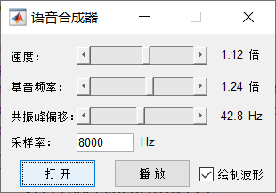


点击 “打开” 任意选择一个 pcm 文件，然后设定采样率，调整速度、基音频率和共振峰偏移，点击播放就可以听到合成语音啦！

勾选 “绘制波形” 则会在播放时画出波形，

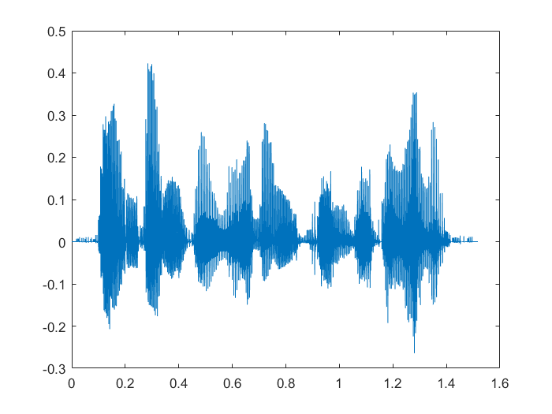


该代码位于 `src/speechproc_gui.m` 和 `src/speechproc_gui.fig`, 此处就不列出了。


## 原创性等级

均为原创。